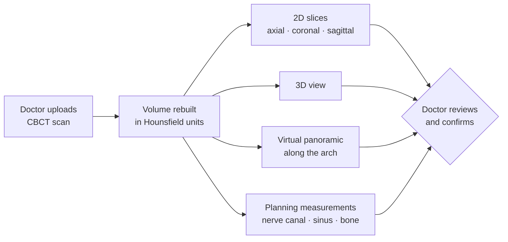

# Noah Studio

**CBCT review and implant-planning assistance for dental implant doctors**, built at AMII.

Noah Studio is part of Noah, the AI assistant and ordering platform I build and run at AMII, a
dental implant company. A doctor loads a patient's cone-beam CT (CBCT) scan, reviews it in 2D and
3D, and gets measurements that help plan an implant. The source code and patient data are private;
this page describes what it does.

## What a doctor can do

| | |
|---|---|
| **Load a scan** | Upload a DICOM series or a ZIP of one; the volume is rebuilt in Hounsfield units |
| **Review in 2D** | Axial, coronal and sagittal slices, with brightness, contrast and clarity controls |
| **Review in 3D** | An orbitable 3D view of bone and teeth |
| **Focus on a tooth** | Jump to a tooth by its Universal number (1–32) |
| **Virtual panoramic** | A panoramic view built from the 3D volume along the dental arch |
| **Planning measurements** | Clearance to the mandibular nerve canal, distance to the sinus floor, bone height and width at a site, airway narrowing |
| **Doctor confirms** | Every measurement is marked as decision support for the doctor to confirm. Nothing is presented as a diagnosis |

## From scan to plan

1. **Upload.** The doctor drops in a scan as a DICOM series or a ZIP. Noah Studio checks it and
   rebuilds a 3D volume where every point carries its tissue density.
2. **Review.** The doctor scrolls the three standard planes, rotates the 3D view, and opens a
   panoramic view built along the dental arch, the view dentists are used to reading.
3. **Focus.** Picking a tooth by its number centers every view on that site.
4. **Measure.** For a planned implant site, Noah Studio measures bone height and width, distance
   to the mandibular nerve canal, distance to the sinus floor, and flags a narrowed airway.
5. **Confirm.** Every number is shown as planning support with what it was measured from. The
   doctor makes the clinical decision; the software never presents a diagnosis.

## How it's built

- **Imaging pipeline:** DICOM series → a 3D volume in Hounsfield units → reformatted slices,
  3D rendering and measurements, all computed on the server.
- **Assist agents with separate jobs:** imaging, measurement, clinical annotation and chat, each
  finishing its part before the result is shown.
- **Clinic data protected by design:** each clinic's scans are encrypted with their own key,
  identifying details are removed before anything can be used for training, and patient files
  are kept apart from everything else.
- **Built for the doctor's judgment:** measurements are labeled as planning aids, and the
  software is not a cleared medical device.

## Stack

Python, NumPy, FastAPI and Flask, Postgres, encrypted object storage, Docker; a browser front end
for 2D and 3D review.

## Status

In development at AMII. A live walkthrough is available on request.
